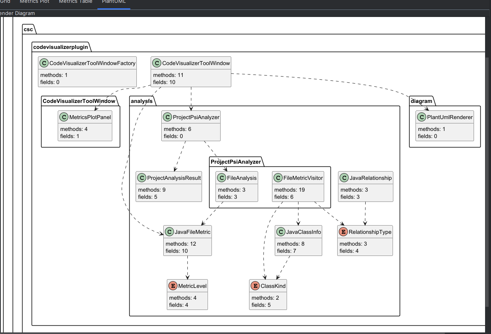

# CodeVisualizerPlugin — Assignment 04(IntelliJ Plugin)

**Code Visualizer Plugin** 

## Features

- Shows four right-side tabs: `Grid`, `Metrics Plot`, `Metrics Table` and `Diagram`
- Computes LOC, cyclomatic complexity, dependencies, instability, abstractness, and distance from the main sequence
- Renders a grid of Java files colored by cyclomatic complexity (Low = green,medium= orange,High = red)
- Plots classes on an abstractness/instability metrics graph
- Generates a PlantUML class diagram from the analyzed repository classes
-Shows comprehensive metrics table with sortable columns

## Metrics

| Metric | Name | Description |
| ------ | ---- | ----------- |
| LOC | Lines of Code | Non-blank lines in the file |
| CC | Cyclomatic Complexity | Count of `if`, `else if`, `for`, `while`, and `switch` keywords |
| D | Dependencies | Number of other repository classes referenced by this file |
| I | Instability | `Cout / (Cin + Cout)` |
| A | Abstractness | `1` for interfaces or abstract classes, otherwise `0` |
| Dms | Distance from Main Sequence | `\|A + I - 1\|`, used in the Metrics tab |

`D` is still used as the dependency count in the Grid tooltip. The Metrics tab uses `Dms` for distance from the main sequence so the two meanings do not conflict in code.

## Visualizations

| Tab | Purpose |
| --- | ------- |
| Grid | Shows each Java File as a colored square. The color represents its complexity (Low = green,medium= orange,High = red) |
| Metrics Plot |Plots files by method count (X-axis) vs. field+branch count (Y-axis)|
| Metrics Table |Displays the file name with amount of Classes,Methods,Constructors,Fields,and Branches. It then sums it all up and gives you a socre|
| Diagram | Generates and renders UML class diagram |

## Class Diagram




## How to Run

**Requirements:** Java 21 

```bash
git clone https://github.com/adrian0427/CodeVisualizerPlugin.git
cd CodeVisualizerPlugin
./gradlew clean build
./gradlew runIde

```

## Usage
1.Open any Java project in IntelliJ IDEA

2.Go to View → Tool Windows → Code Visualizer

3.Click "Analyze Project" button

4.View results in the four tabs:

-Grid: Colored tiles for each Java file with legend

-Metrics Plot: Scatter plot  

-Metrics Table:  data table

-PlantUML Diagram: Class diagram


## Assumptions and Limitations
-only works with Java projects in Intellij IDEA

## Demo Video

[Watch Code Visualizer Plugin Demo](https://www.youtube.com/watch?v=HM_iBdq9DX8)
