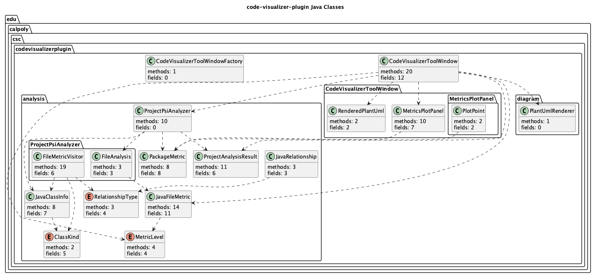

[](https://classroom.github.com/a/sXmj90qY)


# CodeVisualizerPlugin - Assignment 04

CodeVisualizerPlugin is an IntelliJ IDEA plugin for visualizing Java code in the currently opened IDE project. It uses IntelliJ PSI to scan Java files, compute structural and package design metrics, and render the results in a `Code Visualizer` tool window.

## Features

- Runs inside IntelliJ IDEA as a plugin.
- Reads the currently opened IntelliJ project.
- Uses PSI instead of GitHub scraping or URL input.
- Scans `.java` files in the project.
- Shows three tabs: `Grid`, `Metrics`, and `PlantUML`.
- Opens source files when grid tiles are clicked.
- Shows package design metrics with sortable rows, hover tooltips, and click-to-highlight plot points.
- Renders a PlantUML class diagram inside the plugin.

## Metrics

### File Metrics

| Metric | Description |
| --- | --- |
| Classes | Number of classes, interfaces, enums, annotations, and abstract classes in the file |
| Methods | Number of non-constructor methods |
| Constructors | Number of constructors |
| Fields | Number of fields |
| Branches | Count of branch-like PSI nodes: `if`, `for`, enhanced `for`, `while`, ternary expressions, and `switch` |
| LOC | Non-blank lines in the Java file |
| Rough CC | Rough cyclomatic complexity estimate: `branches + 1` |
| Score | File score used for grid color: classes + methods + constructors + fields + branches + rough CC |

### Package Design Metrics

| Metric | Description |
| --- | --- |
| Incoming | Project-internal dependencies from other packages into this package |
| Outgoing | Project-internal dependencies from this package to other packages |
| A | Abstractness: abstract classes and interfaces divided by total classes in the package |
| I | Instability: `outgoing / (incoming + outgoing)` |
| D | Distance from main sequence: `abs(A + I - 1)` |

Relationships are extracted from PSI using inheritance, interface implementation, field types, method return types, and method parameter types.

## Visualizations

| Tab | Purpose |
| --- | --- |
| Grid | Shows one colored tile per Java file. Tile color is based on the file score: green = low, orange = medium, red = high. Clicking a tile opens the source file. |
| Metrics | Shows a package-level Abstractness vs. Instability plot with the main sequence line, plus a sortable package metrics table. Hovering over a plot point shows package details. Clicking a table row highlights that package on the plot. |
| PlantUML | Shows a rendered PlantUML class diagram and the generated PlantUML source text. |

## Class Diagram



## How to Run

Requirements:

- IntelliJ IDEA
- Java 21
- Gradle wrapper included in this repository

```bash
git clone https://github.com/CSC3100/final-project-angelandadrian.git
cd final-project-angelandadrian
./gradlew build
./gradlew runIde
```

`runIde` launches a sandbox IntelliJ IDEA instance with the plugin installed.

## Usage

1. Run the plugin with `./gradlew runIde` or the IntelliJ `Run Plugin` configuration.
2. In the sandbox IntelliJ instance, open a Java project.
3. Go to `View -> Tool Windows -> Code Visualizer`.
4. Click `Analyze Project`.
5. Review the `Grid`, `Metrics`, and `PlantUML` tabs.
6. In the `Metrics` tab, click a package row to highlight it on the plot.
7. Hover over package dots to inspect exact metric values.

## Manual Test Checklist

- Run `./gradlew build`.
- Run `./gradlew runIde`.
- Open a Java project in the sandbox IDE.
- Open `View -> Tool Windows -> Code Visualizer`.
- Click `Analyze Project`.
- Confirm the `Grid` tab shows Java file tiles.
- Confirm clicking a grid tile opens the source file.
- Confirm the `Metrics` tab shows package dots and a sortable table.
- Confirm clicking a metrics table row highlights the matching package dot.
- Confirm hovering over package dots shows package metrics.
- Confirm the `PlantUML` tab shows generated PlantUML text and a rendered diagram when rendering is available.

## Assignment Checklist

- Java 21: yes
- Gradle project: yes
- IntelliJ IDEA plugin: yes
- PSI-based Java analysis: yes
- Analyzes the opened IDE project: yes
- Finds `.java` files: yes
- Tool window named `Code Visualizer`: yes
- Three tabs: `Grid`, `Metrics`, `PlantUML`: yes
- Rendered PlantUML diagram: yes
- Grid items navigate to source files: yes
- No URL input: yes

## Assumptions and Limitations

- The plugin is focused on Java projects.
- LOC counts non-blank lines, not comment-free source lines.
- Rough CC is a lightweight branch-based estimate, not a full formal cyclomatic complexity engine.
- Dependency metrics include project-internal class relationships that can be resolved by PSI.
- PlantUML rendering uses the bundled PlantUML library. If rendering is unavailable in a local environment, the generated PlantUML text remains visible for inspection.

## Demo Video

[Watch Code Visualizer Plugin Demo](https://www.youtube.com/watch?v=cNidgZWfKtQ)
